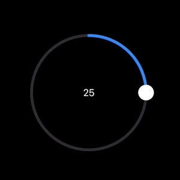
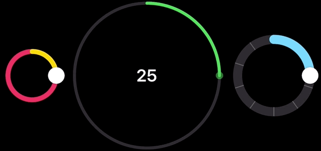
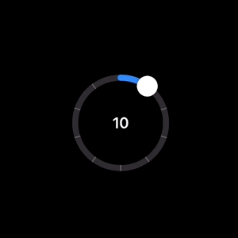

# AdaptiveSlider

#### Create Customizable Sliders

`AdaptiveSlider` is a SwiftUI protocol that enables creations and customization of sliders that can be unique from the native SwiftUI slider.

### CircularSlider

`CircularSlider` is a fully customizable circular slider that fills the gap in the iOS ecosystem, where a rounded slider is often needed for intuitive interactions like selecting angles, time intervals, or volume levels. With customization options such as thumb styles, track colors, haptic feedback, and labels, CircularSlider makes it easy to create sliders that fit perfectly into your application's interface.

## Installation

This repository is a Swift package, so just include it in your Xcode project and target under **File > Add Package Dependencies**. Then, import `AdaptiveSlider` into the Swift files where you'll be using it.

## Usage

### Basic CircularSlider Example

`import AdaptiveSlider` you would like to use `CircularSlider`.

Then, initialize it using the available parameters:

- **value:** A `Binding` representing the current value of the slider.
- **in:** The range within which the slider operates. Default is `0...1`.
- **step:** The incremental step for the slider’s value. Default is `0.01`.
- **label:** (optional) A custom label for the slider. Default is `EmptyView()`.



``` swift
import AdaptiveSlider

struct ContentView: View {
	@State private var sliderValue: Double = 50
	
	var body: some View {
		CircularSlider(value: $sliderValue, in: 0...100) {
			Text(String(format: "%.0f", sliderValue))
		}
	}
}
```

## Customization Examples

Below are some examples of customizing the `CircularSlider` using the available modifiers:

### Customizing Radius, Colors, and Line Width

You can easily adjust the appearance of `CircularSlider` using various modifiers:



```swift
CircularSlider(value: $sliderValue, in: 0...100)
    .radius(120) // Sets the radius of the circular slider.
    .tint(.yellow) // Sets the color of the progress track.
    .trackStyle(lineWidth: 10, color: .gray) // Sets the width of the track and the color of the background.
    .thumbStyle(radius: 8, color: .red) // Sets thumb radius and the color.
```

### Combining Ticks with Steps

You can combine ticks with step increments to create a visually informative slider. The ticks represent specific values within the range, making it easier for users to see key points as they adjust the slider value.



```swift
CircularSlider(value: $sliderValue, in: 0...100, step: 10) {
	Text(String(format: "%.0f", sliderValue))
		.font(.title3)
		.fontWeight(.semibold)
}
.radius(60)
.trackStyle(lineWidth: 8)
.showTicks(count: 10) // Adds visual markers (ticks) to the slider.
```

In this example, the slider is configured with a step of `10`, and `10` ticks are added to provide a visual guide for each step value. This makes it intuitive for users to understand the increments as they adjust the slider.
