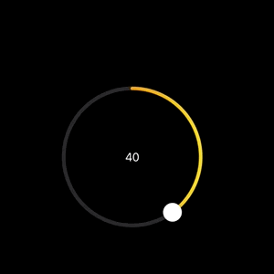

# AdaptiveSlider

[](https://swiftpackageindex.com/Hovig90/AdaptiveSlider) [](https://swiftpackageindex.com/Hovig90/AdaptiveSlider)  

#### Flexible and Stylish Sliders for SwiftUI

## CircularSlider

`CircularSlider` is a fully customizable circular slider that addresses a common need in the iOS ecosystem for sliders with a round design. Whether you are working with time selection, volume adjustment, or angle setting, `CircularSlider` offers unparalleled flexibility. Customization options include gradient progress lines, haptic feedback, ticks, and label support, making it an indispensable tool for creating polished and user-friendly interfaces.

## Installation

#### Package URL

To include the package, use the following URL:

```
https://github.com/Hovig90/AdaptiveSlider.git
```

This repository is available as a Swift package. To include it in your project:

1. Go to **File > Add Package Dependencies** in Xcode.
2. Add the repository URL.
3. Import `AdaptiveSlider` into the Swift files where you'll use it:

```swift
import AdaptiveSlider
```

## Usage

### Basic CircularSlider Example

Add `import AdaptiveSlider` to use `CircularSlider` in your project. Then, initialize it with the following parameters:

* **value:** A `Binding` representing the current value of the slider.
* **in:** The range within which the slider operates. Default is `0...1`.
* **step:** The incremental step for the slider’s value. Default is `0.01`.
* **label:** (optional) A custom label for the slider. Default is `EmptyView()`.


``` swift
import AdaptiveSlider

struct ContentView: View {
    @State private var sliderValue: Double = 50

    var body: some View {
        CircularSlider(value: $sliderValue, in: 0...100) {
            Text(String(format: "%.0f", sliderValue))
        }
    }
}
```

## Customization Examples

Below are examples of how you can customize `CircularSlider` using its powerful modifiers:

### Customizing Radius, Colors, and Line Width

Adjust the appearance of `CircularSlider` to suit your app’s design:


```swift
CircularSlider(value: $sliderValue, in: 0...100)
    .radius(120) // Sets the radius of the circular slider.
    .tint(.yellow) // Customizes the color of the progress track.
    .trackStyle(lineWidth: 10, color: .gray) // Configures the track’s width and color.
    .thumbStyle(radius: 8, color: .red) // Sets the thumb's radius and color.
```

### Combining Ticks with Steps

Add ticks to visualize key values along with step increments. This enhances user interaction by providing clear visual markers.


```swift
CircularSlider(value: $sliderValue, in: 0...100, step: 10) {
    Text(String(format: "%.0f", sliderValue))
        .font(.title3)
        .fontWeight(.semibold)
}
.radius(60)
.trackStyle(lineWidth: 8)
.showTicks(count: 10) // Adds ticks to the slider for better visualization.
```

### Gradient Progress Line



Create visually engaging sliders with gradient progress lines:

```swift
CircularSlider(value: $sliderValue, in: 0...100) {
				Text("\(Int(sliderValue1))")
		}
    .tint(LinearGradient(colors: [.red, .orange, .yellow], startPoint: .top, endPoint: .bottom))
```

### Adding Haptic Feedback

Add haptic feedback for a tactile user experience:

```swift
CircularSlider(value: $sliderValue, in: 0...100)
    .hapticFeedback(.medium)
```

### Accessibility Customizations

Accessibility support is already enabled for `CircularSlider`. However, you can further enhance it by adding descriptive accessibility properties:

```swift
CircularSlider(value: $sliderValue, in: 0...100)
    .accessibilityValue("75 percent", hint: "Adjust the temperature setting", label: "Temperature Control")
```

This modifier allows you to define a custom value, hint, and label for assistive technologies like VoiceOver.

## Found a bug?

If you encounter an issue or have suggestions for improving this project, please submit an issue or pull request. Your contributions are always welcome!
